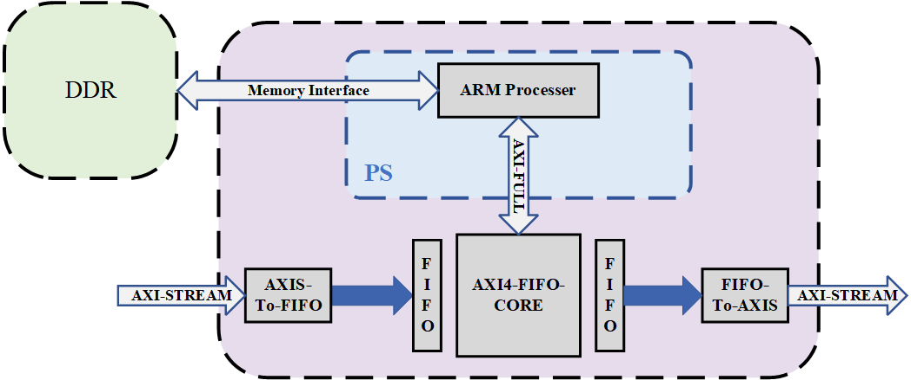

### Functional Description

This project is designed to delay the output of the video stream in **AXI-STREAM** format.

The framework of this project is displayed below:

The storage memory is the DDR located on the PS side, and the interface is also convenient to change to the DDR located on the PL side.

When the video data flows into the system in **AXI-STREAM** format. The data will flow into the forward **FIFO through** the **AXIS-To-FIFO** module, and it will flow out from the backward FIFO through the **FIFO-To-AXIS** module. The read-write operation of the forward FIFO and the backward FIFO is controlled by the **AXI4-FIFO-CORE** module. The operation is described as follows:

> After the forward FIFO is filled with over 1280 data (representing the vertical pixels of one frame), the AXI4-FIFO-CORE switches to the SEND_DATA stage. It then sends the 1280 data with burst mode to DDR through the HP interface.
>
> After certain delay, the backward FIFO read enable signal is activate. When the backward FIFO is empty, the AXI4-FIFO-CORE switches to the READ_DATA stage and reads 1280 data using burst mode from DDR through the HP interface.

### Project Structure

The tree map of this project is shown as below:

> - axi-ddr-axi #vivado project folder
>   - axi-ddr-axi.xpr #vivado project
>   - axi_wr_ddr_tb_behav.wcfg #vivado wave file
> - pic #picture
> - RTL #all necessary code
>   - sim_1 #simulation file
>   - source_1 #source code

After cloning the code using git, you just need to open the Vivado project (version: 2023.1) and run the simulation.